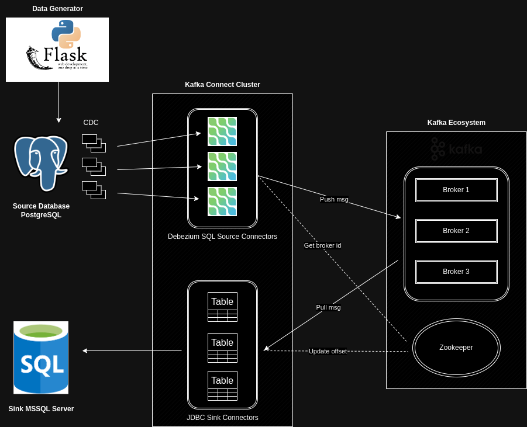

# Project: Database Replication

- [Project: Database Replication](#project-database-replication)
  - [Tasks](#tasks)
  - [Local development guide](#local-development-guide)
    - [Prequisites](#prequisites)
    - [Install codebase](#install-codebase)
    - [Restore the database](#restore-the-database)
  - [Design architecture](#design-architecture)
  - [Database catalog](#database-catalog)
    - [Schema](#schema)
      - [Data schemas](#data-schemas)
      - [Secure-access schemas](#secure-access-schemas)
      - [Development schemas](#development-schemas)
    - [Tables](#tables)
      - [Application schema](#application-schema)
      - [Purchasing schema](#purchasing-schema)
      - [Sales schema](#sales-schema)
      - [Warehouse schema](#warehouse-schema)

## Tasks

Visit here: https://github.com/users/lelouvincx/projects/5/

- [x] Design architecture
- [x] Initialize Postgres with dataset
  - [x] Database catalog
- [x] Build Flask application to fake generate data in realtime
- [ ] Build Kafka Cluster with 3 nodes
- [ ] Unittest for `Fake Data Generation` app
  - [ ] TDD (Test Driven Development)

## Local development guide

### Prequisites
- Python version >= 3.9 (3.11 recommended)
- Docker with docker compose (at least 4 core and 4gb of RAM)

### Install codebase
1. Clone the repository & go to the project location (/database-replication)
2. Install python dependencies
```bash
python -m venv .venv
source .venv/bin/activate
pip install -r app/requirements.txt
```
3. Build docker images
```bash
docker build -t data-generator:localdev -f .docker/build/app/Dockerfile .
```
4. Start docker services
```
make up
```
5. Visit [Makefile](./Makefile) to short-binding commands

### Restore the database

1. Download dump file at https://github.com/Azure/azure-postgresql/blob/master/samples/databases/wide-world-importers/wide_world_importers_pg.dump
2. Place it into ./.docker/backups/postgres
3. Spawn up the postgres container, notice that there's 5 users: admin, azure_pg_admin, azure_superuser, greglow, data_engineer
4. Shell to postgres

```bash
docker compose exec -it source_db /bin/bash
```

5. Restore (inside postgres container)

```bash
pg_restore -h localhost -p 5432 -U admin -W -v -Fc -d wideworldimporters < /backups/wide_world_importers_pg.dump
```

Then enter admin's password and take a coffee.

## Design architecture



## Database catalog

Visit: https://dbdocs.io/lelouvincx/WideWorldImporters

### Schema

WideWorldImporters uses schemas for different purposes, such as storing data, defining how users can access the data, and providing objects for data warehouse development and integration.

#### Data schemas

These schemas contain the data. Many tables are needed by all other schemas and are located in the Application schema.

| Schema      | Description                                                                                                                             |
| ----------- | --------------------------------------------------------------------------------------------------------------------------------------- |
| Application | Application-wide users, contacts, and parameters. This schema also contains reference tables with data that is used by multiple schemas |
| Purchasing  | Stock item purchases from suppliers and details about suppliers.                                                                        |
| Sales       | Stock item sales to retail customers, and details about customers and sales people.                                                     |
| Warehouse   | Stock item inventory and transactions.                                                                                                  |

#### Secure-access schemas

These schemas are used for external applications that are not allowed to access the data tables directly. They contain views and stored procedures used by external applications.

| Schema  | Description                                                                                                |
| ------- | ---------------------------------------------------------------------------------------------------------- |
| Website | All access to the database from the company website is through this schema.                                |
| Reports | All access to the database from Reporting Services reports is through this schema.                         |
| PowerBI | All access to the database from the Power BI dashboards via the Enterprise Gateway is through this schema. |

The Reports and PowerBI schemas are not used in the initial release of the sample database. However, all Reporting Services and Power BI samples built on top of this database are encouraged to use these schemas.

#### Development schemas

Special-purpose schemas

| Schema      | Description                                                                                                                        |
| ----------- | ---------------------------------------------------------------------------------------------------------------------------------- |
| Integration | Objects and procedures required for data warehouse integration (that is, migrating the data to the WideWorldImportersDW database). |
| Sequences   | Holds sequences used by all tables in the application.                                                                             |

### Tables

All tables in the database are in the data schemas.

#### Application schema

Details of parameters and people (users and contacts), along with common reference tables (common to multiple other schemas).

| Table              | Description                                                                                                                                                                                                                                                                                                                                                  |
| ------------------ | ------------------------------------------------------------------------------------------------------------------------------------------------------------------------------------------------------------------------------------------------------------------------------------------------------------------------------------------------------------ |
| SystemParameters   | Contains system-wide configurable parameters.                                                                                                                                                                                                                                                                                                                |
| People             | Contains user names, contact information, for all who use the application, and for the people that the Wide World Importers deals with at customer organizations. This table includes staff, customers, suppliers, and any other contacts. For people who have been granted permission to use the system or website, the information includes login details. |
| Application.cities | There are many addresses stored in the system, for people, customer organization delivery addresses, pickup addresses at suppliers, etc. Whenever an address is stored, there is a reference to a city in this table. There is also a spatial location for each city.                                                                                        |
| StateProvinces     | Application.cities are part of states or provinces. This table has details of those, including spatial data describing the boundaries each state or province.                                                                                                                                                                                                |
| countries          | States or Provinces are part of countries/regions. This table has details of those, including spatial data describing the boundaries of each country/region.                                                                                                                                                                                                 |
| DeliveryMethods    | Choices for delivering stock items (for example, truck/van, post, pickup, courier, etc.)                                                                                                                                                                                                                                                                     |
| PaymentMethods     | Choices for making payments (for example, cash, check, EFT, etc.)                                                                                                                                                                                                                                                                                            |
| TransactionTypes   | Types of customer, supplier, or stock transactions (for example, invoice, credit note, etc.)                                                                                                                                                                                                                                                                 |

#### Purchasing schema

Details of suppliers and of stock item purchases.

| Table                | Description                                                                        |
| -------------------- | ---------------------------------------------------------------------------------- |
| Suppliers            | Main entity table for suppliers (organizations)                                    |
| SupplierCategories   | Categories for suppliers (for example, novelties, toys, clothing, packaging, etc.) |
| SupplierTransactions | All financial transactions that are supplier-related (invoices, payments)          |
| PurchaseOrders       | Details of supplier purchase orders                                                |
| PurchaseOrderLines   | Detail lines from supplier purchase orders                                         |

#### Sales schema

Details of customers, salespeople, and of stock item sales.

| Table                | Description                                                                              |
| -------------------- | ---------------------------------------------------------------------------------------- |
| Customers            | Main entity tables for customers (organizations or individuals)                          |
| CustomerCategories   | Categories for customers (for example, novelty stores, supermarkets, etc.)               |
| BuyingGroups         | Customer organizations can be part of groups that exert greater buying power             |
| CustomerTransactions | All financial transactions that are customer-related (invoices, payments)                |
| SpecialDeals         | Special pricing. This can include fixed prices, discount in dollars or discount percent. |
| Orders               | Detail of customer orders                                                                |
| OrderLines           | Detail lines from customer orders                                                        |
| Invoices             | Details of customer invoices                                                             |
| InvoiceLines         | Detail lines from customer invoices                                                      |

#### Warehouse schema

Details of stock items, their holdings and transactions.

| Table                 | Description                                                                                |
| --------------------- | ------------------------------------------------------------------------------------------ |
| StockItems            | Main entity table for stock items                                                          |
| StockItemHoldings     | Non-temporal columns for stock items. These are frequently updated columns.                |
| StockGroups           | Groups for categorizing stock items (for example, novelties, toys, edible novelties, etc.) |
| StockItemStockGroups  | Which stock items are in which stock groups (many to many)                                 |
| Colors                | Stock items can (optionally) have colors                                                   |
| PackageTypes          | Ways that stock items can be packaged (for example, box, carton, pallet, kg, etc.          |
| StockItemTransactions | Transactions covering all movements of all stock items (receipt, sale, write-off)          |
| VehicleTemperatures   | Regularly recorded temperatures of vehicle chillers                                        |
| ColdRoomTemperatures  | Regularly recorded temperatures of cold room chillers                                      |
